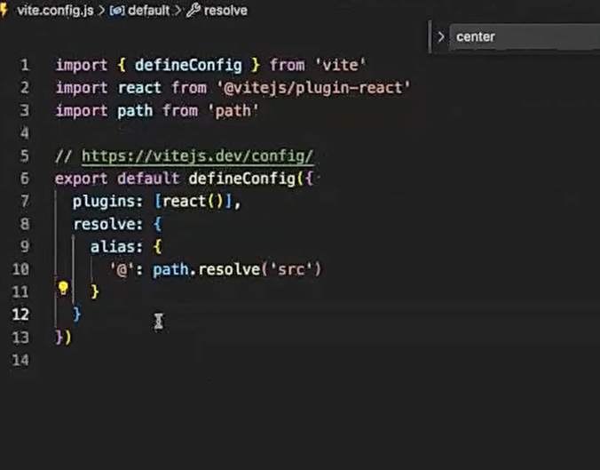

Useeffect happens every time that rendering happen and when it doesnt have any depenecies

with useMemo you can pass a process that happend and when the process finished saves the value so you dont need to do it again

`npm flat-to-nested` is a package that you can make parent/child look like in your project

ANTDESIGN is UI like MUI and its helpfull to work with it

with useCallback you can make react memorize the state, for example if you want to state remember that you did focus on the input and then you unfocused from input.

Memo memorize a component

useMemo memorize a value

We have React.Lazy in react that you can laod it:

```
React.lazy() is a built-in function that allows you to dynamically import a component (i.e., lazy-load it) when it's actually needed. This is useful for optimizing performance by splitting the code and loading parts of the app only when required.
```

with `node.getBoundingClientRec` you can easily see the info about an element that was render in webpage, For example the heaight or left right of an text

if you want to aff the font to your project then you can make it in your css file like this :

```
@font-face {
    font-family: vazir;
    src: url(the path)
}

```

you can make the path of importing shorter :

```
{
    "compilerOptions":{
        "paths":{
            "@/*":["./src/*"]
        }
    }
}
```

with persion tools you can transfer arabic/persion number to english number for sending to backend:

```
npm install @persian-tools/persian-tools
```

you can even transfer the words to number or inverse

with `.replace(/\D/, '')` you can make sure there is only number to type it means replace the words to number

with `Object.assign(Form, { ... })` you can copy objects in the {} to Form it means that you Form now have child like this(for example) :
Form.Email
Form.Password
Form.Text
...

When you has panel admin and you want to edit the personal info of someone :
You can use

with this code in vite.config.js you can make the imports easier like instead of using `src` in the import you use `@` :


Redux:

install it with `npm install @reduxjs/toolkit react-redux`

with combineReducers you can give the list of reducers with an object inside

to use the redux state in your components you can use a high order component with name of `Conect` from react-redux that yhou pass your state to him

with `serve` you can run your server:

```
npm i -g serve
```

gatsby is a good tool for faster loading of our site.
