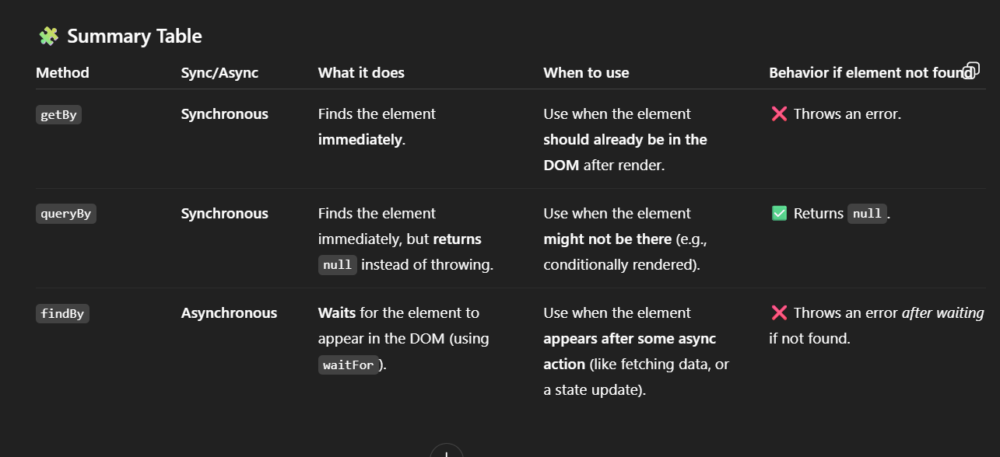

Jest:

installing jest:

```
npm install --save-dev jest
```

then add jest to your scripts:

```
  "scripts": {
    "test": "jest"
  }
```

you have to use `.test.js` for starting the test files or using a folder with name of `__test__` an then every .js files below the folder is the test files

Another way to use the test file is typing the file like `.spec.js`

run the test with `npm run test` or `npm test`

we use `describe` and then `test` to start the test file:

```
describe('title',()=>{
    test('',()=>{

    })
})
```

For knowing is the button works or not you can use `act` and inside of that the `useEvent.click()`:

```
await act(){
    useEvent.click(button)
}
```

For most of the cases we use the `screen.getby...` (sth with that use) for example the `screen.getByText` is for seeing the text inside the screen.

Before and after the click of the useEvent we use the `expect.value()` to see that the value is the expected thing? or not

we give the

For fetching the data :

```
describe('Post', ()=>{
    test('fetching', async()=>{
        let container, root

        container = document.createElement('div')
        document.body.appendChild(container)

        ReactDom.createRoot(container)

        const fakepost ={
            id: 1,
            title: 'Post Title',
            body: 'Post body'
        }


        jest.spyOn(global, 'fetch').mokImplementation(()=>{
            return Promise.resolve({
                json: ()=>{
                    return Promise.reasolve(fakepost)
                }
            })
        })

        await act(()=>{
            root.Render(<Post/>)
        })

        expect(container.querySelector('h1').textContent).tobe('Post item')

        global.fetch.mockRestore()

        await act(()=>{
            root.unmount
        })

        container.remove()
        container = null

    })
})
```

you can put sth that is gonna be every time in beforEach and afteEach:

```
beforEach(()=>{
    container = document.createElement('div')
    document.body.appendChild(container)
    ReactDom.createRoot(container)
})
afterEach(async()=>{
        await act(()=>{
            root.unmount
        })
        container.remove()
        container = null
})
describe(()=>{
    ....
})
```

ALLURE:

For installing the allure-jest you can use this command:

```
npm install --save-dev allure-jest
```

Install the Allure Jest adapter and environment:

```
npm install --save-dev allure-jest jest-environment-node
```

If you're using DOM-based tests (e.g., React), install the JSDOM environment instead:

```
npm install --save-dev allure-jest jest-environment-jsdom
```

For connecting the allure to jest you have to set this in your jset.config.js file:

For Node-based tests:

```
module.exports = {
  testEnvironment: 'allure-jest/node',
};
```

For browser-based tests:

```
module.exports = {
  testEnvironment: 'allure-jest/jsdom',
};

```

For intalling the allure to your project:

```
npm install --save-dev allure-jest
```

For changing the allure path to say has allure just with calling allure :

```
$AllureBinPath = "path of your allure bin "

$NewPath = (([Environment]::GetEnvironmentVariable("PATH", "User") -split ";") | ?{ $_ -and $_ -notlike "*\allure-*\bin" }) -join ";"

[Environment]::SetEnvironmentVariable("PATH", "$NewPath;$AllureBinPath", "User")
```

If the Jest version is lower than 27, install Circus and configure Jest to use it as the test runner:

```
npm install --save-dev jest-circus
```

Then update your config:

```
module.exports = {
  testRunner: 'jest-circus/runner',
  testEnvironment: 'allure-jest/node', // or 'allure-jest/jsdom'
};
```

For creating allure report in your test :

```
allure serve allure-results
```


whats the diffrences between findBy, queryBy, getBy in jest: 

